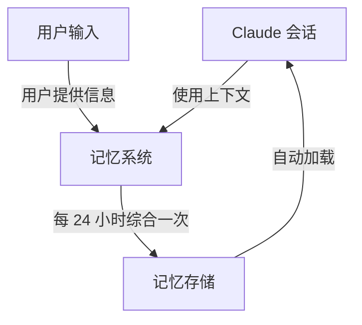
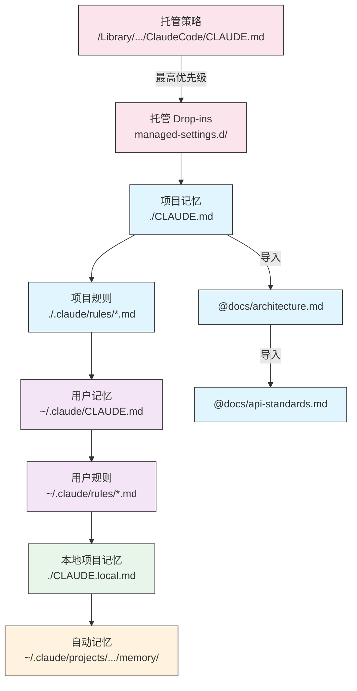
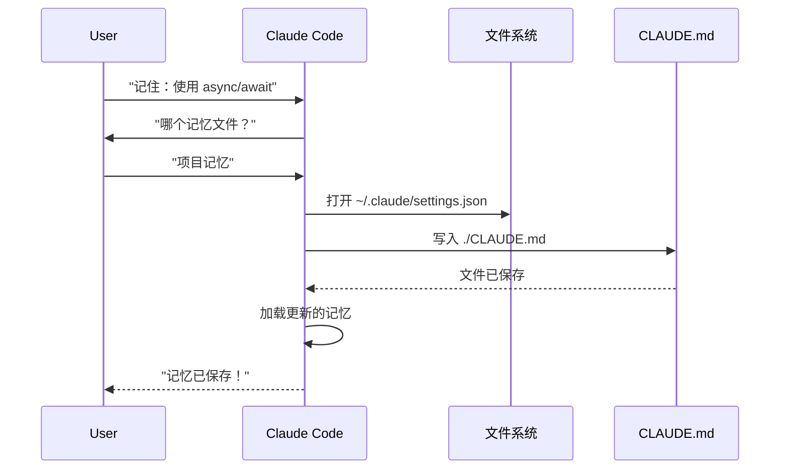
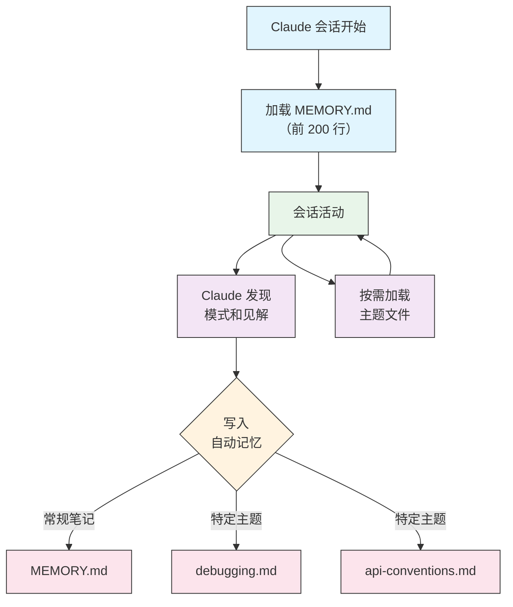

<picture>
  <source media="(prefers-color-scheme: dark)" srcset="../resources/logos/claude-howto-logo-dark.svg">
  
</picture>

# 记忆指南

记忆使 Claude 能够在会话和对话之间保留上下文。它有两种形式：claude.ai 中的自动综合，以及 Claude Code 中基于文件系统的 CLAUDE.md。

## 概述

Claude Code 中的记忆提供了跨多个会话和对话持久化的上下文。与临时上下文窗口不同，记忆文件允许您：

- 在团队之间共享项目标准
- 存储个人开发偏好
- 维护特定目录的规则和配置
- 导入外部文档
- 将记忆作为项目的一部分进行版本控制

记忆系统在多个层级上运行，从全局个人偏好到特定子目录，允许精细控制 Claude 记住什么以及如何应用这些知识。

## 记忆命令快速参考

| 命令 | 用途 | 用法 | 何时使用 |
|---------|---------|-------|-------------|
| `/init` | 初始化项目记忆 | `/init` | 开始新项目，首次设置 CLAUDE.md |
| `/memory` | 在编辑器中编辑记忆文件 | `/memory` | 大量更新、重组、审查内容 |
| `#` 前缀 | 快速添加单行记忆 | `# Your rule here` | 在对话中添加快速规则 |
| `# new rule into memory` | 显式添加记忆 | `# new rule into memory<br/>Your detailed rule` | 添加复杂的多行规则 |
| `# remember this` | 自然语言记忆 | `# remember this<br/>Your instruction` | 对话式记忆更新 |
| `@path/to/file` | 导入外部内容 | `@README.md` 或 `@docs/api.md` | 在 CLAUDE.md 中引用现有文档 |

## 快速入门：初始化记忆

### `/init` 命令

`/init` 命令是在 Claude Code 中设置项目记忆的最快方法。它会初始化一个 CLAUDE.md 文件，其中包含基础项目文档。

**用法：**

```bash
/init
```

**它做什么：**

- 在您的项目中创建新的 CLAUDE.md 文件（通常在 `./CLAUDE.md` 或 `./.claude/CLAUDE.md`）
- 建立项目约定和指南
- 为跨会话的上下文持久化奠定基础
- 提供用于记录项目标准的模板结构

**增强交互模式：** 设置 `CLAUDE_CODE_NEW_INIT=true` 启用多阶段交互流程，逐步引导您完成项目设置：

```bash
CLAUDE_CODE_NEW_INIT=true claude
/init
```

**何时使用 `/init`：**

- 使用 Claude Code 开始新项目
- 建立团队编码标准和约定
- 创建有关代码库结构的文档
- 为协作开发设置记忆层次结构

**示例工作流：**

```markdown
# 在您的项目目录中
/init

# Claude 创建具有以下结构的 CLAUDE.md：
# 项目配置
## 项目概述
- 名称：您的项目
- 技术栈：[您的技术]
- 团队规模：[开发人员数量]

## 开发标准
- 代码风格偏好
- 测试要求
- Git 工作流约定
```

### 使用 `#` 快速更新记忆

您可以在任何对话中通过以 `#` 开头的消息快速添加信息到记忆：

**语法：**

```markdown
# Your memory rule or instruction here
```

**示例：**

```markdown
# 在此项目中始终使用 TypeScript 严格模式

# 更喜欢 async/await 而不是 promise 链

# 每次提交前运行 npm test

# 文件名使用 kebab-case
```

**工作原理：**

1. 以 `#` 开头后跟您的规则开始消息
2. Claude 将其识别为记忆更新请求
3. Claude 询问要更新哪个记忆文件（项目或个人）
4. 规则被添加到适当的 CLAUDE.md 文件
5. 未来的会话自动加载此上下文

**替代模式：**

```markdown
# new rule into memory
始终使用 Zod schemas 验证用户输入

# remember this
所有版本发布使用语义化版本控制

# add to memory
数据库迁移必须是可逆的
```

### `/memory` 命令

`/memory` 命令提供了在 Claude Code 会话中直接编辑 CLAUDE.md 记忆文件的功能。它在您的系统编辑器中打开记忆文件以便进行全面编辑。

**用法：**

```bash
/memory
```

**它做什么：**

- 在系统默认编辑器中打开记忆文件
- 允许进行大量添加、修改和重组
- 提供对层次结构中所有记忆文件的直接访问
- 使您能够管理跨会话的持久上下文

**何时使用 `/memory`：**

- 审查现有记忆内容
- 对项目标准进行大量更新
- 重组记忆结构
- 添加详细文档或指南
- 随着项目演进维护和更新记忆

**比较：`/memory` vs `/init`**

| 方面 | `/memory` | `/init` |
|--------|-----------|---------|
| **目的** | 编辑现有记忆文件 | 初始化新的 CLAUDE.md |
| **何时使用** | 更新/修改项目上下文 | 开始新项目 |
| **操作** | 打开编辑器进行更改 | 生成入门模板 |
| **工作流** | 持续维护 | 一次性设置 |

**示例工作流：**

```markdown
# 打开记忆进行编辑
/memory

# Claude 展示选项：
# 1. 托管策略记忆
# 2. 项目记忆 (./CLAUDE.md)
# 3. 用户记忆 (~/.claude/CLAUDE.md)
# 4. 本地项目记忆

# 选择选项 2（项目记忆）
# 您的默认编辑器打开 ./CLAUDE.md 内容

# 进行更改、保存并关闭编辑器
# Claude 自动重新加载更新的记忆
```

**使用记忆导入：**

CLAUDE.md 文件支持 `@path/to/file` 语法来包含外部内容：

```markdown
# 项目文档
有关项目概述，请参阅 @README.md
有关可用 npm 命令，请参阅 @package.json
有关系统设计，请参阅 @docs/architecture.md

# 使用绝对路径从主目录导入
@~/.claude/my-project-instructions.md
```

**导入功能：**

- 支持相对路径和绝对路径（例如 `@docs/api.md` 或 `@~/.claude/my-project-instructions.md`）
- 支持最多 5 层的递归导入
- 首次从外部位置导入会触发安全批准对话框
- 导入指令不会在 markdown 代码跨度或代码块中求值（因此在示例中记录它们是安全的）
- 通过引用现有文档避免重复
- 自动将引用内容包含在 Claude 的上下文中

## 记忆架构

Claude Code 中的记忆遵循分层系统，不同的范围服务于不同的目的：



## Claude Code 中的记忆层次结构

Claude Code 使用多层分层记忆系统。记忆文件在 Claude Code 启动时自动加载，更高层级的文件优先。

**完整的记忆层次结构（按优先级排序）：**

1. **托管策略** - 组织范围的指令
   - macOS: `/Library/Application Support/ClaudeCode/CLAUDE.md`
   - Linux/WSL: `/etc/claude-code/CLAUDE.md`
   - Windows: `C:\Program Files\ClaudeCode\CLAUDE.md`

2. **托管 Drop-ins** - 按字母顺序合并的策略文件（v2.1.83+）
   - 托管策略 CLAUDE.md 旁边的 `managed-settings.d/` 目录
   - 文件按字母顺序合并以实现模块化策略管理

3. **项目记忆** - 团队共享上下文（版本控制）
   - `./.claude/CLAUDE.md` 或 `./CLAUDE.md`（在仓库根目录）

4. **项目规则** - 模块化、特定主题的项目指令
   - `./.claude/rules/*.md`

5. **用户记忆** - 个人偏好（所有项目）
   - `~/.claude/CLAUDE.md`

6. **用户级规则** - 个人规则（所有项目）
   - `~/.claude/rules/*.md`

7. **本地项目记忆** - 个人项目特定偏好
   - `./CLAUDE.local.md`

> **注意**：截至 2026 年 3 月，`CLAUDE.local.md` 在[官方文档](https://code.claude.com/docs/en/memory)中未提及。它可能仍作为旧版功能工作。对于新项目，考虑使用 `~/.claude/CLAUDE.md`（用户级）或 `.claude/rules/`（项目级、路径范围）。

8. **自动记忆** - Claude 的自动笔记和学习
   - `~/.claude/projects/<project>/memory/`

**记忆发现行为：**

Claude 按此顺序搜索记忆文件，较早的位置优先：



## 使用 `claudeMdExcludes` 排除 CLAUDE.md 文件

在大型 monorepo 中，某些 CLAUDE.md 文件可能与您当前的工作无关。`claudeMdExcludes` 设置允许您跳过特定的 CLAUDE.md 文件，使它们不会被加载到上下文中：

```jsonc
// 在 ~/.claude/settings.json 或 .claude/settings.json 中
{
  "claudeMdExcludes": [
    "packages/legacy-app/CLAUDE.md",
    "vendors/**/CLAUDE.md"
  ]
}
```

模式与相对于项目根目录的路径匹配。这对于以下情况特别有用：

- 包含许多子项目的 Monorepo，其中只有一些相关
- 包含供应商或第三方 CLAUDE.md 文件的仓库
- 通过排除过时或不相关的指令来减少 Claude 上下文窗口中的噪音

## 设置文件层次结构

Claude Code 设置（包括 `autoMemoryDirectory`、`claudeMdExcludes` 和其他配置）从五级层次结构解析，更高级别优先：

| 级别 | 位置 | 范围 |
|-------|----------|-------|
| 1（最高） | 托管策略（系统级） | 组织范围强制执行 |
| 2 | `managed-settings.d/`（v2.1.83+） | 模块化策略 drop-ins，按字母顺序合并 |
| 3 | `~/.claude/settings.json` | 用户偏好 |
| 4 | `.claude/settings.json` | 项目级（提交到 git） |
| 5（最低） | `.claude/settings.local.json` | 本地覆盖（git 忽略） |

**平台特定配置（v2.1.51+）：**

设置也可以通过以下方式配置：
- **macOS**：属性列表（plist）文件
- **Windows**：Windows 注册表

这些平台原生机制与 JSON 设置文件一起读取，并遵循相同的优先级规则。

## 模块化规则系统

使用 `.claude/rules/` 目录结构创建有组织的、特定路径的规则。规则可以在项目级和用户级定义：

```
your-project/
├── .claude/
│   ├── CLAUDE.md
│   └── rules/
│       ├── code-style.md
│       ├── testing.md
│       ├── security.md
│       └── api/                  # 支持子目录
│           ├── conventions.md
│           └── validation.md

~/.claude/
├── CLAUDE.md
└── rules/                        # 用户级规则（所有项目）
    ├── personal-style.md
    └── preferred-patterns.md
```

规则在 `rules/` 目录中递归发现，包括任何子目录。`~/.claude/rules/` 中的用户级规则在项目级规则之前加载，允许项目可以覆盖的个人默认值。

### 使用 YAML Frontmatter 的特定路径规则

定义仅适用于特定文件路径的规则：

```markdown
---
paths: src/api/**/*.ts
---

# API 开发规则

- 所有 API 端点必须包含输入验证
- 使用 Zod 进行 schema 验证
- 记录所有参数和响应类型
- 为所有操作包含错误处理
```

**Glob 模式示例：**

- `**/*.ts` - 所有 TypeScript 文件
- `src/**/*` - src/ 下的所有文件
- `src/**/*.{ts,tsx}` - 多个扩展名
- `{src,lib}/**/*.ts, tests/**/*.test.ts` - 多个模式

### 子目录和符号链接

`.claude/rules/` 中的规则支持两个组织功能：

- **子目录**：规则递归发现，因此您可以将它们组织到基于主题的文件夹中（例如 `rules/api/`、`rules/testing/`、`rules/security/`）
- **符号链接**：支持符号链接以便在多个项目之间共享规则。例如，您可以将共享规则文件从中心位置符号链接到每个项目的 `.claude/rules/` 目录

## 记忆位置表

| 位置 | 范围 | 优先级 | 共享 | 访问 | 最佳用途 |
|----------|-------|----------|--------|--------|----------|
| `/Library/Application Support/ClaudeCode/CLAUDE.md` (macOS) | 托管策略 | 1（最高） | 组织 | 系统 | 公司范围策略 |
| `/etc/claude-code/CLAUDE.md` (Linux/WSL) | 托管策略 | 1（最高） | 组织 | 系统 | 组织标准 |
| `C:\Program Files\ClaudeCode\CLAUDE.md` (Windows) | 托管策略 | 1（最高） | 组织 | 系统 | 企业指南 |
| `managed-settings.d/*.md`（策略旁边） | 托管 Drop-ins | 1.5 | 组织 | 系统 | 模块化策略文件（v2.1.83+） |
| `./CLAUDE.md` 或 `./.claude/CLAUDE.md` | 项目记忆 | 2 | 团队 | Git | 团队标准、共享架构 |
| `./.claude/rules/*.md` | 项目规则 | 3 | 团队 | Git | 特定路径、模块化规则 |
| `~/.claude/CLAUDE.md` | 用户记忆 | 4 | 个人 | 文件系统 | 个人偏好（所有项目） |
| `~/.claude/rules/*.md` | 用户规则 | 5 | 个人 | 文件系统 | 个人规则（所有项目） |
| `./CLAUDE.local.md` | 项目本地 | 6 | 个人 | Git（忽略） | 个人项目特定偏好 |
| `~/.claude/projects/<project>/memory/` | 自动记忆 | 7（最低） | 个人 | 文件系统 | Claude 的自动笔记和学习 |

## 记忆更新生命周期

以下是记忆更新在您的 Claude Code 会话中的流程：



## 自动记忆

自动记忆是一个持久目录，Claude 在与您的项目合作时会自动记录学习内容、模式和见解。与您手动编写和维护的 CLAUDE.md 文件不同，自动记忆由 Claude 在会话期间自行编写。

### 自动记忆如何工作

- **位置**：`~/.claude/projects/<project>/memory/`
- **入口点**：`MEMORY.md` 作为自动记忆目录中的主文件
- **主题文件**：可选的其他文件用于特定主题（例如 `debugging.md`、`api-conventions.md`）
- **加载行为**：`MEMORY.md` 的前 200 行在会话开始时加载到系统提示中。主题文件按需加载，不在启动时加载。
- **读/写**：Claude 在会话期间读取和写入记忆文件，发现模式和项目特定知识

### 自动记忆架构



### 自动记忆目录结构

```
~/.claude/projects/<project>/memory/
├── MEMORY.md              # 入口点（启动时加载前 200 行）
├── debugging.md           # 主题文件（按需加载）
├── api-conventions.md     # 主题文件（按需加载）
└── testing-patterns.md    # 主题文件（按需加载）
```

### 版本要求

自动记忆需要 **Claude Code v2.1.59 或更高版本**。如果您使用的是旧版本，请先升级：

```bash
npm install -g @anthropic-ai/claude-code@latest
```

### 自定义自动记忆目录

默认情况下，自动记忆存储在 `~/.claude/projects/<project>/memory/`。您可以使用 `autoMemoryDirectory` 设置更改此位置（自 **v2.1.74** 起可用）：

```jsonc
// 在 ~/.claude/settings.json 或 .claude/settings.local.json 中（仅用户/本地设置）
{
  "autoMemoryDirectory": "/path/to/custom/memory/directory"
}
```

> **注意**：`autoMemoryDirectory` 只能在用户级（`~/.claude/settings.json`）或本地设置（`.claude/settings.local.json`）中设置，不能在项目或托管策略设置中设置。

这对于以下情况很有用：

- 将自动记忆存储在共享或同步位置
- 将自动记忆与默认 Claude 配置目录分开
- 使用默认层次结构之外的项目特定路径

### Worktree 和仓库共享

同一 git 仓库中的所有 worktree 和子目录共享一个自动记忆目录。这意味着在 worktree 之间切换或在同一仓库的不同子目录中工作将读取和写入相同的记忆文件。

### 子代理记忆

子代理（通过 Task 或并行执行等工具生成）可以有自己的记忆上下文。在子代理定义中使用 `memory` frontmatter 字段指定要加载的记忆范围：

```yaml
memory: user      # 仅加载用户级记忆
memory: project   # 仅加载项目级记忆
memory: local     # 仅加载本地记忆
```

这允许子代理以聚焦的上下文操作，而不是继承完整的记忆层次结构。

### 控制自动记忆

可以通过 `CLAUDE_CODE_DISABLE_AUTO_MEMORY` 环境变量控制自动记忆：

| 值 | 行为 |
|-------|----------|
| `0` | 强制开启自动记忆 |
| `1` | 强制关闭自动记忆 |
| *(未设置)* | 默认行为（启用自动记忆） |

```bash
# 为会话禁用自动记忆
CLAUDE_CODE_DISABLE_AUTO_MEMORY=1 claude

# 显式强制开启自动记忆
CLAUDE_CODE_DISABLE_AUTO_MEMORY=0 claude
```

## 使用 `--add-dir` 添加其他目录

`--add-dir` 标志允许 Claude Code 从当前工作目录之外的其他目录加载 CLAUDE.md 文件。这对于 monorepo 或多项目设置非常有用，其中来自其他目录的上下文是相关的。

要启用此功能，设置环境变量：

```bash
CLAUDE_CODE_ADDITIONAL_DIRECTORIES_CLAUDE_MD=1
```

然后使用该标志启动 Claude Code：

```bash
claude --add-dir /path/to/other/project
```

Claude 将从指定的其他目录加载 CLAUDE.md 以及当前工作目录的记忆文件。

## 实用示例

### 示例 1：项目记忆结构

**文件：** `./CLAUDE.md`

```markdown
# 项目配置

## 项目概述
- **名称**：电子商务平台
- **技术栈**：Node.js、PostgreSQL、React 18、Docker
- **团队规模**：5 名开发人员
- **截止日期**：2025 年第四季度

## 架构
@docs/architecture.md
@docs/api-standards.md
@docs/database-schema.md

## 开发标准

### 代码风格
- 使用 Prettier 进行格式化
- 使用 ESLint 和 airbnb 配置
- 最大行长度：100 个字符
- 使用 2 空格缩进

### 命名约定
- **文件**：kebab-case（user-controller.js）
- **类**：PascalCase（UserService）
- **函数/变量**：camelCase（getUserById）
- **常量**：UPPER_SNAKE_CASE（API_BASE_URL）
- **数据库表**：snake_case（user_accounts）

### Git 工作流
- 分支名称：`feature/description` 或 `fix/description`
- 提交消息：遵循约定式提交
- 合并前需要 PR
- 所有 CI/CD 检查必须通过
- 至少需要 1 个批准

### 测试要求
- 最低 80% 代码覆盖率
- 所有关键路径必须有测试
- 单元测试使用 Jest
- E2E 测试使用 Cypress
- 测试文件名：`*.test.ts` 或 `*.spec.ts`

### API 标准
- 仅 RESTful 端点
- JSON 请求/响应
- 正确使用 HTTP 状态码
- API 端点版本化：`/api/v1/`
- 使用示例记录所有端点

### 数据库
- 使用迁移进行 schema 更改
- 永远不要硬编码凭据
- 使用连接池
- 在开发中启用查询日志
- 需要定期备份

### 部署
- 基于 Docker 的部署
- Kubernetes 编排
- 蓝绿部署策略
- 失败时自动回滚
- 部署前运行数据库迁移

## 常用命令

| 命令 | 用途 |
|---------|---------|
| `npm run dev` | 启动开发服务器 |
| `npm test` | 运行测试套件 |
| `npm run lint` | 检查代码风格 |
| `npm run build` | 生产构建 |
| `npm run migrate` | 运行数据库迁移 |

## 团队联系人
- 技术负责人：Sarah Chen (@sarah.chen)
- 产品经理：Mike Johnson (@mike.j)
- DevOps：Alex Kim (@alex.k)

## 已知问题和解决方法
- 高峰时段 PostgreSQL 连接池限制为 20
- 解决方法：实现查询排队
- Safari 14 与异步生成器的兼容性问题
- 解决方法：使用 Babel 转译器

## 相关项目
- 分析仪表板：`/projects/analytics`
- 移动应用：`/projects/mobile`
- 管理面板：`/projects/admin`
```

### 示例 2：特定目录记忆

**文件：** `./src/api/CLAUDE.md`

```markdown
# API 模块标准

此文件覆盖 /src/api/ 中所有内容的根 CLAUDE.md

## API 特定标准

### 请求验证
- 使用 Zod 进行 schema 验证
- 始终验证输入
- 返回 400 和验证错误
- 包含字段级错误详情

### 身份验证
- 所有端点需要 JWT 令牌
- 令牌在 Authorization 头中
- 令牌 24 小时后过期
- 实现刷新令牌机制

### 响应格式

所有响应必须遵循此结构：

```json
{
  "success": true,
  "data": { /* 实际数据 */ },
  "timestamp": "2025-11-06T10:30:00Z",
  "version": "1.0"
}
```

错误响应：
```json
{
  "success": false,
  "error": {
    "code": "VALIDATION_ERROR",
    "message": "用户消息",
    "details": { /* 字段错误 */ }
  },
  "timestamp": "2025-11-06T10:30:00Z"
}
```

### 分页
- 使用基于游标的分页（不是偏移量）
- 包含 `hasMore` 布尔值
- 最大页面大小限制为 100
- 默认页面大小：20

### 速率限制
- 已认证用户每小时 1000 个请求
- 公共端点每小时 100 个请求
- 超出时返回 429
- 包含 retry-after 头

### 缓存
- 使用 Redis 进行会话缓存
- 缓存持续时间：默认 5 分钟
- 写操作时失效
- 用资源类型标记缓存键
```

### 示例 3：个人记忆

**文件：** `~/.claude/CLAUDE.md`

```markdown
# 我的开发偏好

## 关于我
- **经验水平**：8 年全栈开发经验
- **首选语言**：TypeScript、Python
- **沟通风格**：直接，带示例
- **学习风格**：带代码的可视化图表

## 代码偏好

### 错误处理
我更喜欢使用 try-catch 块和有意义的错误消息进行显式错误处理。
避免通用错误。始终记录错误以便调试。

### 注释
为原因写注释，而不是为内容写。代码应该自我文档化。
注释应该解释业务逻辑或不明显的决策。

### 测试
我更喜欢 TDD（测试驱动开发）。
先写测试，然后实现。
关注行为，而不是实现细节。

### 架构
我更喜欢模块化、松耦合的设计。
使用依赖注入以提高可测试性。
分离关注点（控制器、服务、仓库）。

## 调试偏好
- 使用带前缀的 console.log：`[DEBUG]`
- 包含上下文：函数名、相关变量
- 可用时使用堆栈跟踪
- 始终在日志中包含时间戳

## 沟通
- 用图表解释复杂概念
- 在解释理论之前展示具体示例
- 包含前后代码片段
- 在末尾总结要点

## 项目组织
我这样组织项目：

   project/
   ├── src/
   │   ├── api/
   │   ├── services/
   │   ├── models/
   │   └── utils/
   ├── tests/
   ├── docs/
   └── docker/

## 工具
- **IDE**：带 vim 键绑定的 VS Code
- **终端**：带 Oh-My-Zsh 的 Zsh
- **格式化**：Prettier（100 字符行长度）
- **Linter**：带 airbnb 配置的 ESLint
- **测试框架**：带 React Testing Library 的 Jest
```

_我的测试_
让 Claude 保存新规则


Claude 没有保存规则，因为我没有任何 `Claude.md` 文件。然后让 Claude 确认位置。


### 示例 4：会话期间的记忆更新

您可以在活动的 Claude Code 会话期间向记忆添加新规则。有两种方法可以做到这一点：

#### 方法 1：直接请求

```markdown
用户：记住我更喜欢对所有新组件使用 React hooks 而不是类组件。

Claude：我正在将其添加到您的记忆中。这个规则应该放在哪个记忆文件中？
        1. 项目记忆 (./CLAUDE.md)
        2. 个人记忆 (~/.claude/CLAUDE.md)

用户：项目记忆

Claude：✅ 记忆已保存！

已添加到 ./CLAUDE.md：
---

### 组件开发
- 使用带有 React Hooks 的函数式组件
- 更喜欢 hooks 而不是类组件
- 可复用逻辑使用自定义 hooks
- 事件处理程序使用 useCallback
- 昂贵的计算使用 useMemo
```

#### 方法 2：使用 "# new rule into memory" 模式

您也可以使用显式模式 "# new rule into memory" 来触发记忆更新：

```markdown
用户：# new rule into memory
      在处理之前始终使用 Zod schemas 验证用户输入。

Claude：我正在将此规则保存到记忆中。应该使用哪个记忆文件？
        1. 项目记忆 (./CLAUDE.md)
        2. 个人记忆 (~/.claude/CLAUDE.md)

用户：项目记忆

Claude：✅ 记忆已保存！

已添加到 ./CLAUDE.md：
---

### 输入验证
- 在处理之前始终使用 Zod schemas 验证用户输入
- 在每个 API 处理程序文件的顶部定义 schemas
- 返回 400 状态和验证错误
```

#### 添加记忆的技巧

- 规则要具体、可操作
- 在章节标题下将相关规则分组
- 更新现有章节而不是重复内容
- 选择适当的记忆范围（项目 vs 个人）

## 记忆功能比较

| 功能 | Claude Web/Desktop | Claude Code (CLAUDE.md) |
|---------|-------------------|------------------------|
| 自动综合 | ✅ 每 24 小时 | ❌ 手动 |
| 跨项目 | ✅ 共享 | ❌ 项目特定 |
| 团队访问 | ✅ 共享项目 | ✅ Git 跟踪 |
| 可搜索 | ✅ 内置 | ✅ 通过 `/memory` |
| 可编辑 | ✅ 聊天内 | ✅ 直接文件编辑 |
| 导入/导出 | ✅ 是 | ✅ 复制/粘贴 |
| 持久化 | ✅ 24 小时+ | ✅ 无限期 |

### Claude Web/Desktop 中的记忆

#### 记忆综合时间线


**示例记忆摘要：**

```markdown
## Claude 对用户的记忆

### 职业背景
- 高级全栈开发人员，8 年经验
- 专注于 TypeScript/Node.js 后端和 React 前端
- 活跃的开源贡献者
- 对 AI 和机器学习感兴趣

### 项目背景
- 当前正在构建电子商务平台
- 技术栈：Node.js、PostgreSQL、React 18、Docker
- 与 5 名开发人员的团队合作
- 使用 CI/CD 和蓝绿部署

### 沟通偏好
- 更喜欢直接、简洁的解释
- 喜欢可视化图表和示例
- 欣赏代码片段
- 在注释中解释业务逻辑

### 当前目标
- 提高 API 性能
- 将测试覆盖率提高到 90%
- 实现缓存策略
- 记录架构
```

## 最佳实践

### 应该 - 包含什么

- **具体且详细**：使用清晰、详细的指令而不是模糊的指导
  - ✅ 好："所有 JavaScript 文件使用 2 空格缩进"
  - ❌ 避免："遵循最佳实践"

- **保持有组织**：使用清晰的 markdown 章节和标题构建记忆文件

- **使用适当的层次级别**：
  - **托管策略**：公司范围策略、安全标准、合规要求
  - **项目记忆**：团队标准、架构、编码约定（提交到 git）
  - **用户记忆**：个人偏好、沟通风格、工具选择
  - **目录记忆**：模块特定规则和覆盖

- **利用导入**：使用 `@path/to/file` 语法引用现有文档
  - 支持最多 5 层递归嵌套
  - 避免记忆文件之间的重复
  - 示例：`有关项目概述请参阅 @README.md`

- **记录常用命令**：包含您重复使用的命令以节省时间

- **版本控制项目记忆**：将项目级 CLAUDE.md 文件提交到 git 以便团队受益

- **定期审查**：随着项目演进和需求变化定期更新记忆

- **提供具体示例**：包含代码片段和特定场景

### 不应该 - 避免什么

- **不要存储机密**：永远不要包含 API 密钥、密码、令牌或凭据

- **不要包含敏感数据**：不要有 PII、私人信息或专有机密

- **不要重复内容**：使用导入（`@path`）引用现有文档代替

- **不要模糊**：避免像"遵循最佳实践"或"写好代码"这样的通用语句

- **不要让文件太长**：保持单个记忆文件专注且在 500 行以内

- **不要过度组织**：战略性使用层次结构；不要创建过多的子目录覆盖

- **不要忘记更新**：过时的记忆会导致混淆和过时的实践

- **不要超过嵌套限制**：记忆导入支持最多 5 层嵌套

### 记忆管理技巧

**选择正确的记忆级别：**

| 用例 | 记忆级别 | 理由 |
|----------|-------------|-----------|
| 公司安全策略 | 托管策略 | 组织范围适用于所有项目 |
| 团队代码风格指南 | 项目 | 通过 git 与团队共享 |
| 您的首选编辑器快捷键 | 用户 | 个人偏好，不共享 |
| API 模块标准 | 目录 | 仅特定于该模块 |

**快速更新工作流：**

1. 单条规则：在对话中使用 `#` 前缀
2. 多项更改：使用 `/memory` 打开编辑器
3. 初始设置：使用 `/init` 创建模板

**导入最佳实践：**

```markdown
# 好：引用现有文档
@README.md
@docs/architecture.md
@package.json

# 避免：复制存在于其他地方的内容
# 与其将 README 内容复制到 CLAUDE.md，不如直接导入它
```

## 安装说明

### 设置项目记忆

#### 方法 1：使用 `/init` 命令（推荐）

设置项目记忆的最快方法：

1. **导航到您的项目目录：**
   ```bash
   cd /path/to/your/project
   ```

2. **在 Claude Code 中运行 init 命令：**
   ```bash
   /init
   ```

3. **Claude 将创建并填充 CLAUDE.md**，包含模板结构

4. **自定义生成的文件**以匹配您的项目需求

5. **提交到 git：**
   ```bash
   git add CLAUDE.md
   git commit -m "使用 /init 初始化项目记忆"
   ```

#### 方法 2：手动创建

如果您更喜欢手动设置：

1. **在项目根目录创建 CLAUDE.md：**
   ```bash
   cd /path/to/your/project
   touch CLAUDE.md
   ```

2. **添加项目标准：**
   ```bash
   cat > CLAUDE.md << 'EOF'
   # 项目配置

   ## 项目概述
   - **名称**：您的项目名称
   - **技术栈**：列出您的技术
   - **团队规模**：开发人员数量

   ## 开发标准
   - 您的编码标准
   - 命名约定
   - 测试要求
   EOF
   ```

3. **提交到 git：**
   ```bash
   git add CLAUDE.md
   git commit -m "添加项目记忆配置"
   ```

#### 方法 3：使用 `#` 快速更新

一旦 CLAUDE.md 存在，在对话中快速添加规则：

```markdown
# 所有版本发布使用语义化版本控制

# 提交前始终运行测试

# 更喜欢组合而不是继承
```

Claude 会提示您选择要更新的记忆文件。

### 设置个人记忆

1. **创建 ~/.claude 目录：**
   ```bash
   mkdir -p ~/.claude
   ```

2. **创建个人 CLAUDE.md：**
   ```bash
   touch ~/.claude/CLAUDE.md
   ```

3. **添加您的偏好：**
   ```bash
   cat > ~/.claude/CLAUDE.md << 'EOF'
   # 我的开发偏好

   ## 关于我
   - 经验水平：[您的级别]
   - 首选语言：[您的语言]
   - 沟通风格：[您的风格]

   ## 代码偏好
   - [您的偏好]
   EOF
   ```

### 设置特定目录记忆

1. **为特定目录创建记忆：**
   ```bash
   mkdir -p /path/to/directory/.claude
   touch /path/to/directory/CLAUDE.md
   ```

2. **添加目录特定规则：**
   ```bash
   cat > /path/to/directory/CLAUDE.md << 'EOF'
   # [目录名称] 标准

   此文件覆盖此目录的根 CLAUDE.md。

   ## [特定标准]
   EOF
   ```

3. **提交到版本控制：**
   ```bash
   git add /path/to/directory/CLAUDE.md
   git commit -m "添加 [目录] 记忆配置"
   ```

### 验证设置

1. **检查记忆位置：**
   ```bash
   # 项目根记忆
   ls -la ./CLAUDE.md

   # 个人记忆
   ls -la ~/.claude/CLAUDE.md
   ```

2. **Claude Code 将自动加载**启动会话时的这些文件

3. **在项目中启动新会话**测试 Claude Code

## 官方文档

有关最新信息，请参阅官方 Claude Code 文档：

- **[记忆文档](https://code.claude.com/docs/en/memory)** - 完整记忆系统参考
- **[斜杠命令参考](https://code.claude.com/docs/en/interactive-mode)** - 所有内置命令包括 `/init` 和 `/memory`
- **[CLI 参考](https://code.claude.com/docs/en/cli-reference)** - 命令行界面文档

### 官方文档中的关键技术细节

**记忆加载：**

- 所有记忆文件在 Claude Code 启动时自动加载
- Claude 从当前工作目录向上遍历以发现 CLAUDE.md 文件
- 访问子目录时，子树文件会被发现并按上下文加载

**导入语法：**

- 使用 `@path/to/file` 包含外部内容（例如 `@~/.claude/my-project-instructions.md`）
- 支持相对路径和绝对路径
- 支持递归导入，最大深度为 5
- 首次外部导入会触发批准对话框
- 不在 markdown 代码跨度或代码块中求值
- 自动将引用内容包含在 Claude 的上下文中

**记忆层次优先级：**

1. 托管策略（最高优先级）
2. 托管 Drop-ins（`managed-settings.d/`，v2.1.83+）
3. 项目记忆
4. 项目规则（`.claude/rules/`）
5. 用户记忆
6. 用户级规则（`~/.claude/rules/`）
7. 本地项目记忆
8. 自动记忆（最低优先级）

## 相关概念链接

### 集成点
- [MCP 协议](../05-mcp/) - 与记忆并存的实时数据访问
- [斜杠命令](../01-slash-commands/) - 会话特定快捷方式
- [技能](../03-skills/) - 带有记忆上下文的自动化工作流

### 相关 Claude 功能
- [Claude Web 记忆](https://claude.ai) - 自动综合
- [官方记忆文档](https://code.claude.com/docs/en/memory) - Anthropic 文档